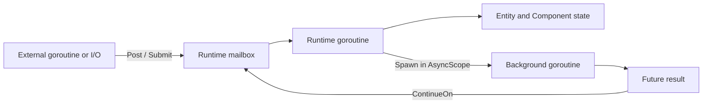
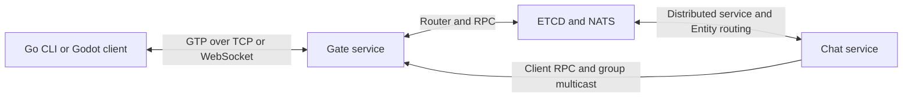

# Golaxy Examples

**English** | [简体中文](./README.zh_CN.md)

Runnable reference programs for [Golaxy Core](https://github.com/pangdogs/core) and the [Golaxy Distributed Service Development Framework](https://github.com/pangdogs/framework). The repository demonstrates how Actor-style Runtime domains, Entity-Component business objects, structured asynchronous work, distributed add-ins, gateways, and RPC fit together in real programs.

These projects are intentionally compact and favor visible control flow over production abstraction. For a larger project structure and build-time tooling, see [Golaxy Scaffold](https://github.com/pangdogs/scaffold).

## Contents

- [Learning path](#learning-path)
- [Example catalog](#example-catalog)
- [Execution model](#execution-model)
- [Quick start](#quick-start)
- [Chat application](#chat-application)
- [Development](#development)
- [Ecosystem and license](#ecosystem-and-license)

## Learning Path

1. Start with [`core/demo_ec`](./core/demo_ec) to see Service, Runtime, Entity, Component, frame, and lifecycle relationships.
2. Continue with [`core/demo_async`](./core/demo_async) to learn lifecycle-bound background work and Runtime continuations.
3. Read [`core/demo_addin`](./core/demo_addin) for Service add-in declaration, installation, access, and shutdown.
4. Choose a focused example under [`official_addins`](./official_addins) for the infrastructure capability you need.
5. Finish with [`app/demo_chat`](./app/demo_chat), which composes the execution model and distributed add-ins into one application.

## Example Catalog

| Example | What it demonstrates | External services | Exit behavior |
| --- | --- | --- | --- |
| [`core/demo_ec`](./core/demo_ec) | Runtime frame loop and complete Entity/Component lifecycle | None | About 10 seconds |
| [`core/demo_async`](./core/demo_async) | Component `AsyncScope`, `Spawn`, `Future`, cancellation, and `ContinueOn` | None | Less than 1 second |
| [`core/demo_addin`](./core/demo_addin) | Service add-in definition, installation, lookup, and shutdown | None | About 10 seconds |
| [`official_addins/demo_broker`](./official_addins/demo_broker) | NATS publish/subscribe through the broker add-in | NATS | About 10 seconds |
| [`official_addins/demo_discovery`](./official_addins/demo_discovery) | ETCD registration, lease keepalive, and discovery events | ETCD | About 10 seconds |
| [`official_addins/demo_dsvc`](./official_addins/demo_dsvc) | Distributed service registration and message delivery | ETCD, NATS | About 10 seconds |
| [`official_addins/demo_dsync`](./official_addins/demo_dsync) | Concurrent ETCD distributed-lock contenders without blocking Runtime state | ETCD | About 10 seconds |
| [`official_addins/demo_dent`](./official_addins/demo_dent) | Global Entity registration, lookup, and cross-node one-way RPC | ETCD, NATS | About 10 seconds |
| [`official_addins/demo_rpc`](./official_addins/demo_rpc) | Entity RPC, forwarding, and call-chain propagation across service replicas | ETCD, NATS | About 10 seconds |
| [`official_addins/demo_gate`](./official_addins/demo_gate) | GTP gateway, session-owned Entity, echo I/O, reconnect, and clock probing | None | Runs until stopped |
| [`app/demo_chat`](./app/demo_chat) | Gate, Router, distributed entities/services, RPC, groups, and Go/Godot clients | ETCD, NATS | Runs until stopped |

The Core examples expose the low-level APIs directly. Framework-based examples may add convenience methods and lifecycle checks around the same Core primitives.

## Execution Model

Each Runtime owns an Actor-style serialized execution domain. Entity and Component business state should be read or mutated only from lifecycle callbacks or work executing on that Runtime.



- `Post` performs mailbox delivery without allocating a result Future. Use it when only enqueue success matters.
- `Submit` returns a Future for the Runtime callback result and execution error.
- `Spawn` runs blocking or external work in a lifecycle-bound Scope. Its `context.Context` is canceled when the owner shuts down.
- `ContinueOn` returns a Future result to the owning Runtime before business state is changed.
- Waiting synchronously on a Future whose completion depends on the same Runtime is rejected; keep the Runtime goroutine non-blocking.

[`core/demo_async`](./core/demo_async) is the smallest complete example of this boundary.

## Quick Start

### Requirements

- Go `1.25.0` or a version compatible with the current [`go.mod`](./go.mod).
- Docker with Compose for ETCD/NATS-backed examples.
- Godot `4.6` when running the graphical chat client.

Download dependencies and run the standalone examples from the repository root:

```bash
go mod download
go run ./core/demo_ec
go run ./core/demo_async
go run ./core/demo_addin
```

Start the shared local infrastructure before running an official distributed example:

```bash
docker compose -f app/demo_chat/docker-compose.yaml up -d etcd nats
go run ./official_addins/demo_rpc
```

The Compose file publishes ETCD on `localhost:2379` and NATS on `localhost:4222`, matching the focused examples' defaults. Stop them with:

```bash
docker compose -f app/demo_chat/docker-compose.yaml down
```

### Gateway Example

Run the server and client in separate terminals:

```bash
go run ./official_addins/demo_gate
```

```bash
go run ./official_addins/demo_gate/client localhost:9090
```

Enter text in the client to send it through the GTP connection and receive the reversed echo.

## Chat Application

`demo_chat` is the end-to-end example. One process assembles `gate` and `chat` services; Gate accepts TCP/WebSocket clients, Router maps sessions and multicast groups, distributed Entity discovery locates user state, and RPC forwards calls between services and clients.



### Run Everything with Compose

Build the current checkout and start the chat server, ETCD, and NATS:

```bash
docker compose -f app/demo_chat/docker-compose.yaml up --build -d
```

Then run the Go terminal client:

```bash
go run ./app/demo_chat/cli \
  --cli_priv_key ./app/demo_chat/bin/cli.pem \
  --serv_pub_key ./app/demo_chat/bin/serv.pub
```

### Run the Server from Go

Start only the infrastructure with Compose, then run the server from the checkout:

```bash
docker compose -f app/demo_chat/docker-compose.yaml up -d etcd nats
go run ./app/demo_chat/server \
  --cli_pub_key ./app/demo_chat/bin/cli.pub \
  --serv_priv_key ./app/demo_chat/bin/serv.pem
```

The Go client accepts these commands:

- `create <channel>`
- `remove <channel>`
- `join <channel>`
- `leave <channel>`
- `switch <channel>`
- `rtt`
- Any other input sends a message to the selected channel.

The graphical client is a Godot 4.6 project at [`app/demo_chat/cli/godot`](./app/demo_chat/cli/godot). Open [`project.godot`](./app/demo_chat/cli/godot/project.godot), run it, and connect to the default `ws://localhost:8080` endpoint.

> The key files under `app/demo_chat/bin` are public demo credentials. Never reuse them in a deployed environment; generate and protect application-specific keys.

## Development

Run the repository-wide checks from the module root:

```bash
go test ./...
go vet ./...
```

Every directory containing `package main` is also built by `go test`. The infrastructure-backed examples compile without ETCD or NATS, but those services are required when the programs run.

## Ecosystem and License

- [Golaxy Core](https://github.com/pangdogs/core): EC model, Runtime, lifecycle, events, and structured asynchronous execution.
- [Golaxy Framework](https://github.com/pangdogs/framework): service assembly, distributed add-ins, RPC, Gate, and protocol stack.
- [Golaxy Scaffold](https://github.com/pangdogs/scaffold): game-project tooling, code generation, and data pipelines.

This repository is licensed under the [GNU Lesser General Public License v2.1](./LICENSE).
