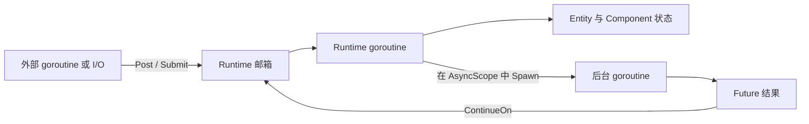
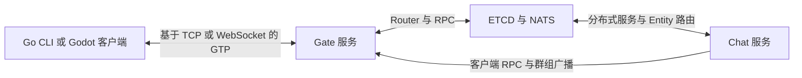

# Golaxy Examples

[English](./README.md) | **简体中文**

本仓库提供 [Golaxy Core](https://github.com/pangdogs/core) 与 [Golaxy 分布式服务开发框架](https://github.com/pangdogs/framework) 的可运行参考示例，展示 Actor 风格 Runtime、Entity-Component 业务对象、结构化异步任务、分布式 add-in、网关和 RPC 如何组合成实际程序。

这些示例刻意保持精简，以清晰呈现控制流为主，不作为生产项目模板。需要更完整的工程结构和构建期工具时，请参考 [Golaxy Scaffold](https://github.com/pangdogs/scaffold)。

## 目录

- [学习顺序](#学习顺序)
- [示例总览](#示例总览)
- [执行模型](#执行模型)
- [快速开始](#快速开始)
- [聊天应用](#聊天应用)
- [开发与验证](#开发与验证)
- [生态与许可证](#生态与许可证)

## 学习顺序

1. 从 [`core/demo_ec`](./core/demo_ec) 开始，理解 Service、Runtime、Entity、Component、帧循环和生命周期之间的关系。
2. 阅读 [`core/demo_async`](./core/demo_async)，掌握绑定生命周期的后台任务与 Runtime 续体。
3. 阅读 [`core/demo_addin`](./core/demo_addin)，了解 Service add-in 的声明、安装、访问和关闭。
4. 根据所需基础设施能力，选择 [`official_addins`](./official_addins) 下的对应示例。
5. 最后阅读 [`app/demo_chat`](./app/demo_chat)，观察执行模型与分布式 add-in 如何组合成完整应用。

## 示例总览

| 示例 | 演示内容 | 外部服务 | 退出方式 |
| --- | --- | --- | --- |
| [`core/demo_ec`](./core/demo_ec) | Runtime 帧循环与完整 Entity/Component 生命周期 | 无 | 约 10 秒 |
| [`core/demo_async`](./core/demo_async) | 组件 `AsyncScope`、`Spawn`、Future、取消和 `ContinueOn` | 无 | 1 秒内 |
| [`core/demo_addin`](./core/demo_addin) | Service add-in 的定义、安装、查找和关闭 | 无 | 约 10 秒 |
| [`official_addins/demo_broker`](./official_addins/demo_broker) | 通过 broker add-in 使用 NATS 发布与订阅 | NATS | 约 10 秒 |
| [`official_addins/demo_discovery`](./official_addins/demo_discovery) | ETCD 注册、租约保活和服务发现事件 | ETCD | 约 10 秒 |
| [`official_addins/demo_dsvc`](./official_addins/demo_dsvc) | 分布式服务注册与消息传递 | ETCD、NATS | 约 10 秒 |
| [`official_addins/demo_dsync`](./official_addins/demo_dsync) | 多个 ETCD 分布式锁竞争者，以及避免阻塞 Runtime 状态 | ETCD | 约 10 秒 |
| [`official_addins/demo_dent`](./official_addins/demo_dent) | 全局 Entity 注册、查询和跨节点单向 RPC | ETCD、NATS | 约 10 秒 |
| [`official_addins/demo_rpc`](./official_addins/demo_rpc) | 跨服务副本的 Entity RPC、转发和调用链传递 | ETCD、NATS | 约 10 秒 |
| [`official_addins/demo_gate`](./official_addins/demo_gate) | GTP 网关、会话 Entity、回显、重连和时钟探测 | 无 | 手动停止 |
| [`app/demo_chat`](./app/demo_chat) | Gate、Router、分布式实体/服务、RPC、群组及 Go/Godot 客户端 | ETCD、NATS | 手动停止 |

Core 示例直接展示底层 API；Framework 示例可能在相同 Core 原语之上增加便捷方法和生命周期检查。

## 执行模型

每个 Runtime 都拥有一个 Actor 风格的串行执行域。Entity 和 Component 的业务状态只能在生命周期回调或该 Runtime 执行的任务中读写。



- `Post` 只进行邮箱投递，不创建结果 Future；只关心是否成功入队时使用它。
- `Submit` 返回 Runtime 回调结果及执行错误对应的 Future。
- `Spawn` 在绑定生命周期的 Scope 中执行阻塞或外部工作；宿主关闭时会取消传入的 `context.Context`。
- `ContinueOn` 先把 Future 结果送回所属 Runtime，再修改业务状态。
- Runtime 不允许同步等待必须依靠自身继续执行才能完成的 Future；Runtime goroutine 应保持非阻塞。

[`core/demo_async`](./core/demo_async) 是这套执行边界的最小完整示例。

## 快速开始

### 环境要求

- Go `1.25.0`，或与当前 [`go.mod`](./go.mod) 兼容的版本。
- 运行 ETCD/NATS 相关示例时需要 Docker Engine 和 Compose v2，可通过 `docker compose version` 验证。
- 运行图形聊天客户端时需要 Godot `4.6`。

在仓库根目录下载依赖并运行不依赖外部服务的示例：

```bash
go mod download
go run ./core/demo_ec
go run ./core/demo_async
go run ./core/demo_addin
```

运行官方分布式示例前，先启动共享的本地基础设施：

```bash
docker compose -f app/demo_chat/docker-compose.yaml up -d etcd nats
go run ./official_addins/demo_rpc
```

Compose 会把 ETCD 发布到 `localhost:2379`，把 NATS 发布到 `localhost:4222`，与各精简示例的默认地址一致。停止基础设施：

```bash
docker compose -f app/demo_chat/docker-compose.yaml down
```

### 网关示例

分别在两个终端运行服务端和客户端：

```bash
go run ./official_addins/demo_gate
```

```bash
go run ./official_addins/demo_gate/client localhost:9090
```

在客户端输入文本后，数据会经过 GTP 连接并以反转后的内容回显。

## 聊天应用

`demo_chat` 是端到端示例。一个进程同时装配 `gate` 和 `chat` 服务：Gate 接收 TCP/WebSocket 客户端，Router 管理会话映射和组播分组，分布式 Entity 发现负责定位用户状态，RPC 负责服务间及服务到客户端的调用转发。



### 使用 Compose 运行全部服务

构建当前工作树，并启动聊天服务端、ETCD 和 NATS：

```bash
docker compose -f app/demo_chat/docker-compose.yaml up --build -d
```

镜像构建会在 builder 容器内编译 Go 服务端。低内存主机出现 `compile: signal: killed` 通常表示宿主机或容器内存耗尽，并非日志中对应的 Go 包编译错误。可以增加 swap、换用内存更充足的机器构建，或由 CI 构建并发布镜像后再在目标主机启动。

然后运行 Go 终端客户端：

```bash
go run ./app/demo_chat/cli \
  --cli_priv_key ./app/demo_chat/bin/cli.pem \
  --serv_pub_key ./app/demo_chat/bin/serv.pub
```

### 从 Go 源码运行服务端

只通过 Compose 启动基础设施，再从当前工作树运行服务端：

```bash
docker compose -f app/demo_chat/docker-compose.yaml up -d etcd nats
go run ./app/demo_chat/server \
  --cli_pub_key ./app/demo_chat/bin/cli.pub \
  --serv_priv_key ./app/demo_chat/bin/serv.pem
```

Go 客户端支持以下命令：

- `create <channel>`
- `remove <channel>`
- `join <channel>`
- `leave <channel>`
- `switch <channel>`
- `rtt`
- 其他输入会作为消息发送到当前频道。

图形客户端位于 [`app/demo_chat/cli/godot`](./app/demo_chat/cli/godot)，使用 Godot 4.6。打开 [`project.godot`](./app/demo_chat/cli/godot/project.godot) 并运行，然后连接默认地址 `ws://localhost:8080`。

> `app/demo_chat/bin` 中的密钥是公开的演示凭据。部署时不得复用，必须重新生成并妥善保管业务自己的密钥。

## 开发与验证

在模块根目录执行完整检查：

```bash
go test ./...
go vet ./...
```

`go test` 也会构建所有包含 `package main` 的目录。依赖基础设施的示例在没有 ETCD 或 NATS 时仍可编译，但实际运行时必须先启动对应服务。

## 生态与许可证

- [Golaxy Core](https://github.com/pangdogs/core)：EC 模型、Runtime、生命周期、事件和结构化异步执行。
- [Golaxy Framework](https://github.com/pangdogs/framework)：服务装配、分布式 add-in、RPC、Gate 和协议栈。
- [Golaxy Scaffold](https://github.com/pangdogs/scaffold)：游戏工程工具、代码生成和数据流水线。

本仓库采用 [GNU Lesser General Public License v2.1](./LICENSE)。
